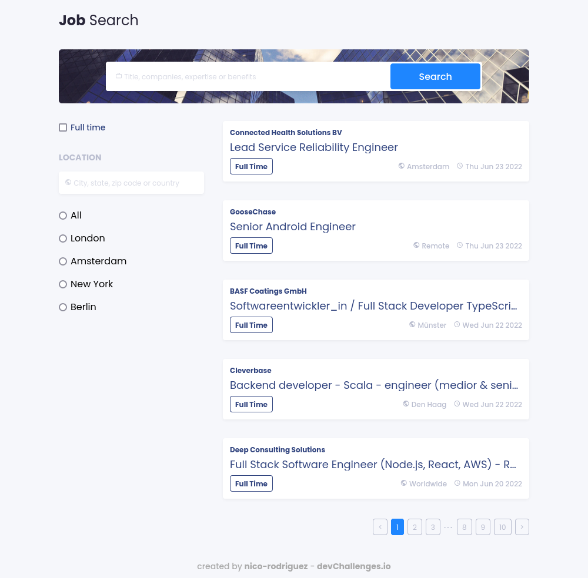
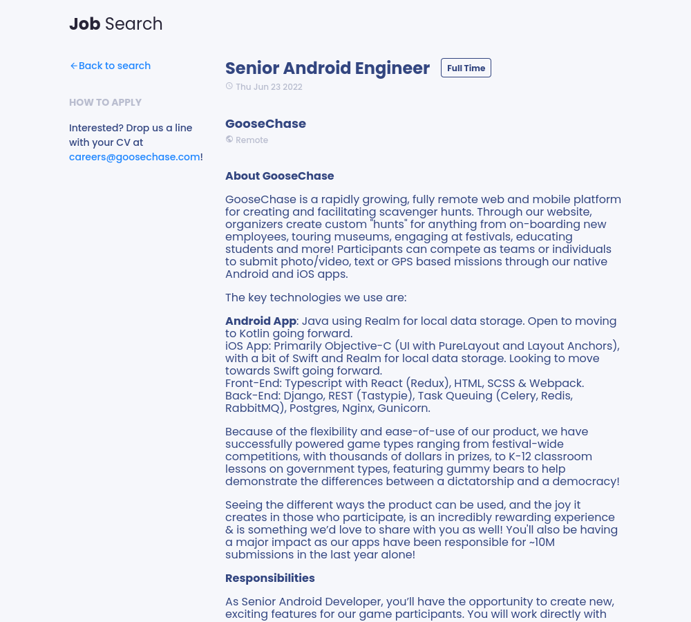
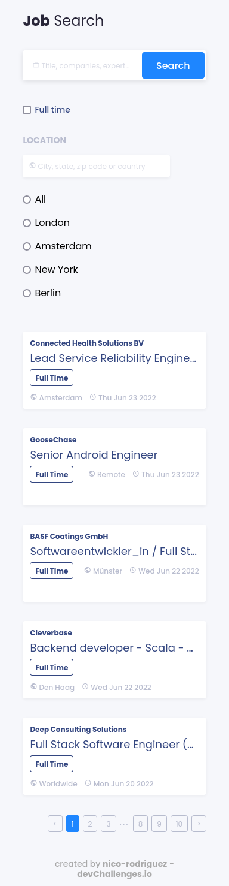
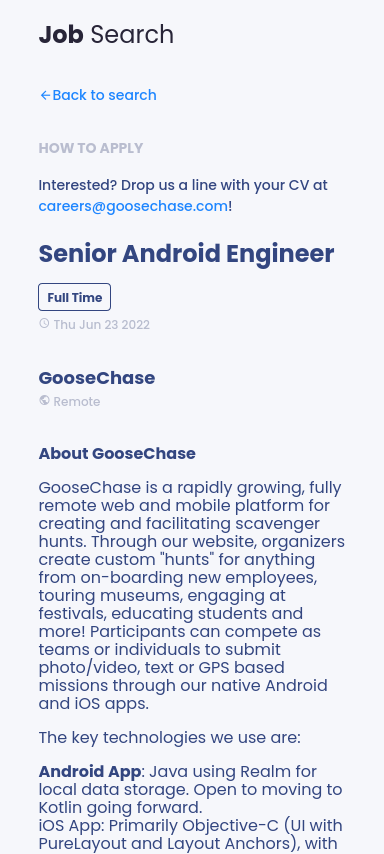

<h1 align="center">Job Search</h1>

   Solution for a challenge from  <a href="http://devchallenges.io" target="_blank">Devchallenges.io</a>.

  <h3>
    <a href="https://job-search-26a082.netlify.app/">
      Solution
    </a>
     | 
    <a href="https://devchallenges.io/challenges/TtUjDt19eIHxNQ4n5jps">
      Challenge
    </a>
  </h3>

## Overview

Visit [https://job-search-26a082.netlify.app/](https://job-search-26a082.netlify.app/).

### Desktop

Home page

Job page

### Mobile

Home page

Job page

### Built With

- [React](https://reactjs.org/)
- [TypeScript](https://www.typescriptlang.org/)

## Features

This application/site was created as a submission to a [DevChallenges](https://devchallenges.io/challenges) challenge. The [challenge](https://devchallenges.io/challenges/TtUjDt19eIHxNQ4n5jps) was to build an application to complete the given user stories.

Features:

- Implemented in TypeScript.
- Filter jobs by location, name or anything included in its description.
- Job list organized inside a paginator.
- Responsive design (desktop and mobile).
